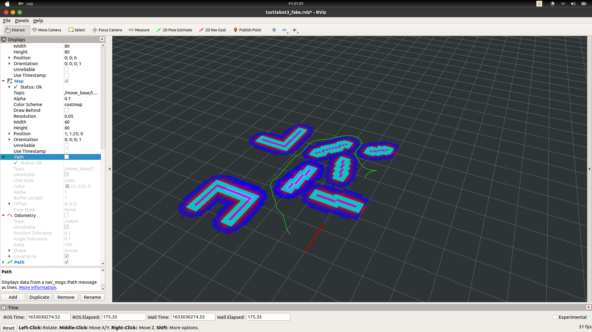

# Robot-Maze-Solver
Different heuristic based path planners integrated with ROS for a non-holonomic robot

Steps to follow:

1. ```git clone https://github.com/sb369/Robot-Maze-Solver.git```
2. ```cd Robot-Maze-Solver```
3. ```catkin_make```
4.  Then open 4 terminals and in each terminal: ```source devel/setup.bash``` (Note: use bash terminal)
5.  on the first terminal: ```export TURTLEBOT3_MODEL=burger``` then ```roslaunch turtlebot3_fake turtlebot3_task.launch```
6.  on second terminal: ```rosrun tf2_ros static_transform_publisher 1 1 0 0 0 0 map odom```
7.  on third terminal: ```rosrun planner nodex```
8.  on fourth terminal: ```rostopic list```

The planner module has all the different types of path planners. You can change the global planner you want to use.

The heuristic can be modified to consider steering model of a car as well




HAstar_park: hybrid A* for car parking
HAstar_local: hybrid A* for general planning //IGNORE
Astar: A* algorithm
RAstar: Relaxed A* algorithm
Tstar: Theta* algorithm

run nodex for visualization
